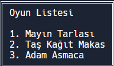

# Proje-1
 
Merhaba Sunuma Hoşgeldiniz.
Konsol uygulamam 5 farklı menüye sahip.
 
 
 
Konsolun Menü Seçim EKranı
 
 

 
 
Konsolun Hesap Makinesi Seçim Ekranı
 
 

 
 
Konsolun Oyun Seçim Ekranı
 
 

 
 
Konsolun Çizim Seçim Ekraanı

 
 
Konsolun Not Hesabı Ve Harf Notu Seçim Ekranı

